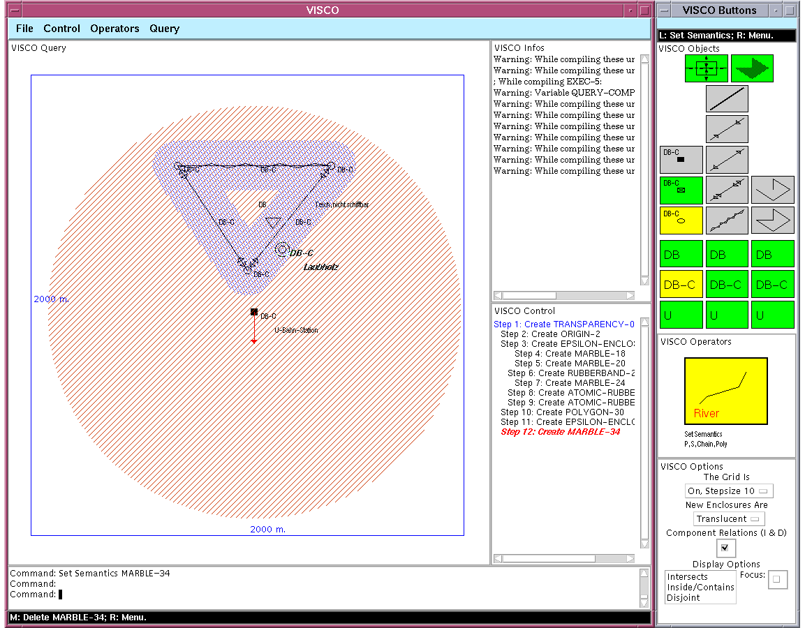
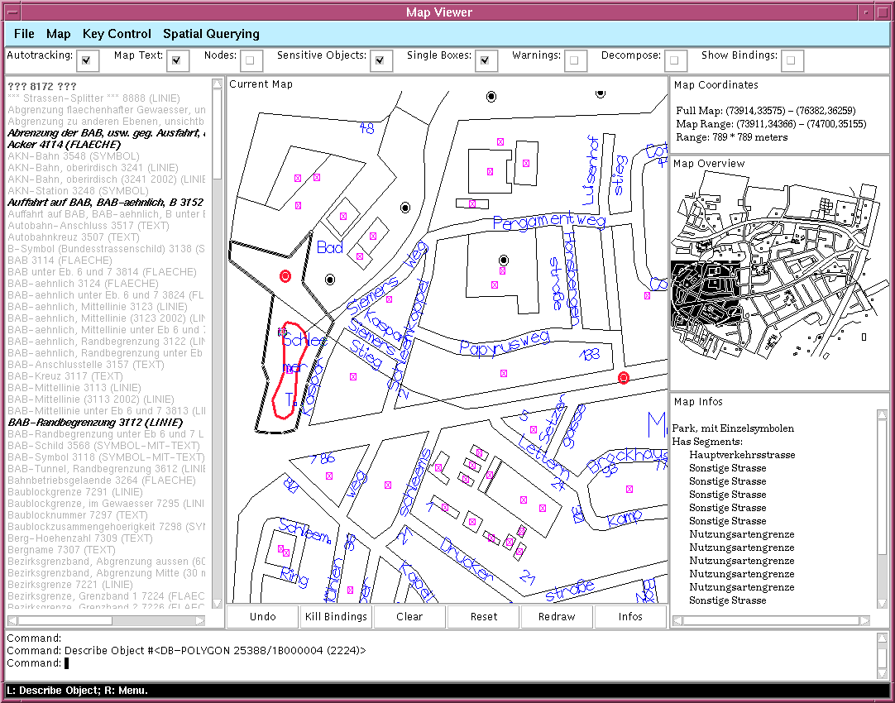
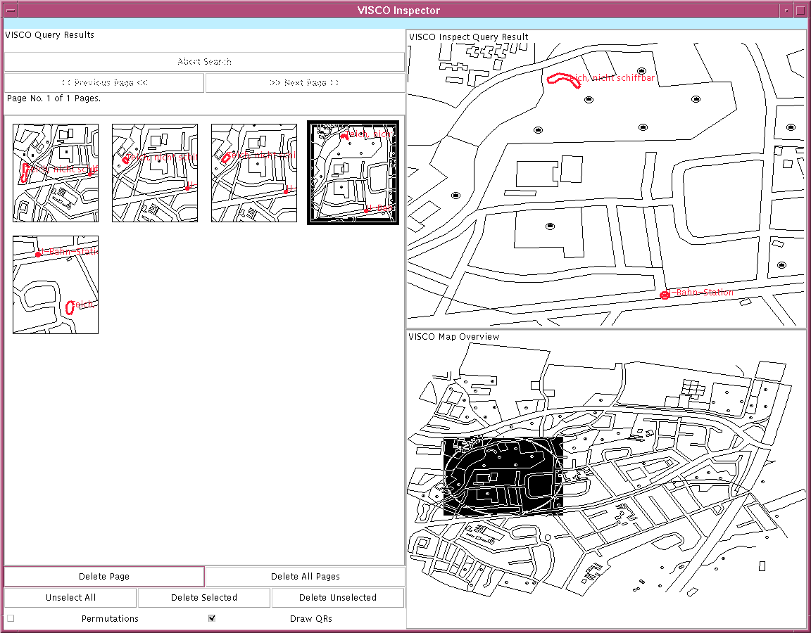
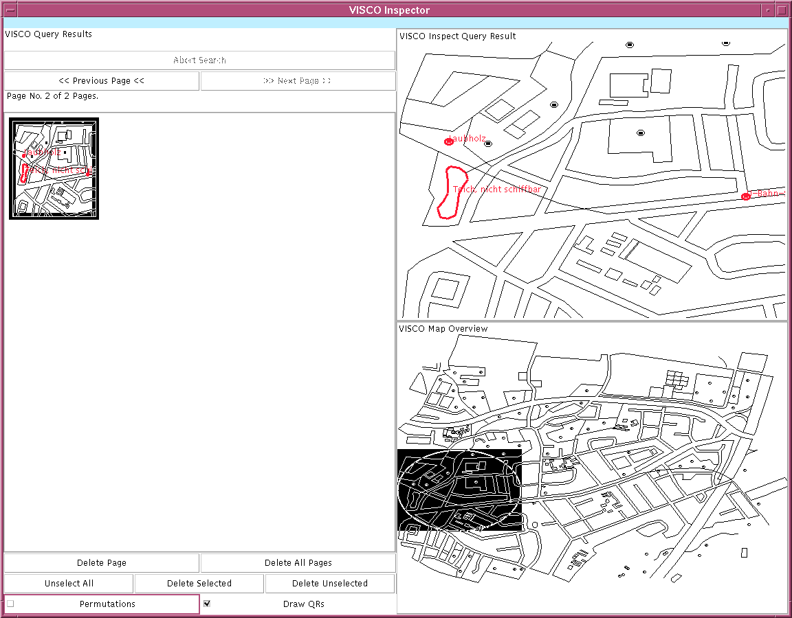

# VISCO
A Visual Spatial Query Language written in Common Lisp &amp; CLIM for its GUI

## About

This was written from 1997 - 1998, and is the program described in my
diploma thesis.  Check out [the VISCO home
page](https://www.michael-wessel.info/visco.html) for details.

Unfortunately, this really seems to requires ACL CLIM 2, for which I
don't have a license, so I cannot test it. My LispWorks 6.1 CLIM gives
me a `Segmentation Violation` when it encounters the
`define-application-frame` :-( 

Anyhow, this is how it used to look like, with ACL (5?) on a Sun
workstation in 1998:

## Papers 

[Diploma theses, 1998](https://www.michael-wessel.info/papers/diplom.pdf)

[IEEE Symposium on Visual Languages, 1998](https://www.michael-wessel.info/papers/vl98web.pdf) 

